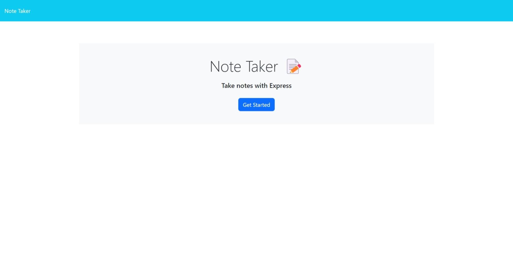

# byte-note-taker  

## Description

This is the repo for a deployed heroku app.  The app can be viewed at: [Heroku app](https://blooming-gorge-09699.herokuapp.com).  It allows you to write, save, view, and delete notes from a json file.  It is an example of my experience with Heroku.

## Table of Contents

* [Installation](#installation)
* [Usage](#usage)
* [License](#license)
* [Contributing](#contributing)
* [Tests](#tests)
* [Questions](#questions)

## Installation

This requires that you have node.js installed if you want to run it on a localhost server. You would type: `npm i` and then `npm start` if you wanted to run it on your own machine.

## Usage

Use the save symbol to save and the trashcan symbol to delete.  Please note as there is no login or security, anything you write in the notes will be visable to anyone with the url of the applicaltion

## License  

  This project is licensed under the MIT license.
  
## Contributing

I'm not taking contributions at this time but welcome an email should you have any questions.

## Tests

There are no tests at this time but it is something I'm considering for the future.

## Questions

Project created by: lesley-byte.
Feel free to contact me by email with any questions: [Email](mailto:phosphorescence3@hotmail.com)

My Github profile is at: [GitHub](https://github.com/lesley-byte)